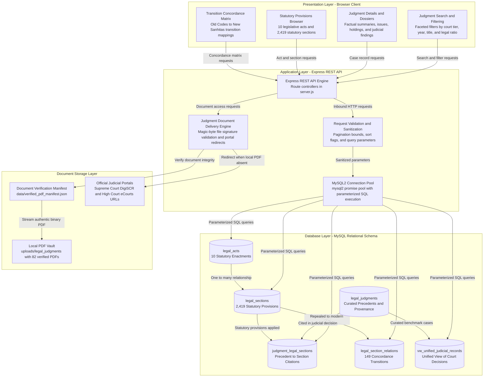

# Judiciary Information System (JIS)

> Full-stack legal intelligence platform providing structured access to Indian judicial precedents, statutory enactments, and criminal law transition concordances.

[](https://nodejs.org/)
[](https://expressjs.com/)
[](https://www.mysql.com/)
[](#running-tests)
[](LICENSE)

---

## Overview

The **Judiciary Information System (JIS)** is an open legal reference and research platform designed to model Indian case law, legislative enactments, and statutory transitions. The application bridges the gap between historical criminal enactments (Indian Penal Code 1860, Code of Criminal Procedure 1973, Indian Evidence Act 1872) and the newly implemented criminal codes (Bharatiya Nyaya Sanhita 2023, Bharatiya Nagarik Suraksha Sanhita 2023, Bharatiya Sakshya Adhiniyam 2023).

JIS operates without heavy frontend dependencies or complex build steps, pairing a lightweight Express.js REST API with a responsive vanilla JavaScript interface backed by a normalized MySQL relational schema.

---

## Application Showcase

| Constitutional Home & Portal | Judicial Precedents Explorer |
| :---: | :---: |
|  |  |

---

## Key Features

- **Judicial Precedents Explorer**: Search thousands of judicial decisions by case name, citation, legal issue, or ratio decidendi, with faceted filtering by court tier and judgment year.
- **Structured Case Dossiers**: Comprehensive case records featuring legal issues, holdings, judicial findings, cited statutory provisions, and direct official PDF document delivery.
- **Statutory Acts & Provisions Directory**: Covers 10 statutory enactments and 2,419 provisions across constitutional, civil, and criminal law with official marginal headings, commencement dates, and chapter classifications.
- **Criminal Law Transition Concordance**: Bidirectional mapping matrix connecting 149 provisions of repealed colonial codes to their modern Sanhita counterparts, detailing legislative changes, punishment comparisons, and statutory transitional saving rules.
- **RESTful API**: Standardized JSON API powering search, filtering, metadata retrieval, and document streaming.

---

## System Architecture



---

## Tech Stack

- **Runtime**: Node.js (v18.x, v20.x, v22.x)
- **Backend**: Express.js 5.x
- **Database**: MySQL 8.0 with `mysql2/promise` connection pooling
- **Frontend**: Semantic HTML5, CSS3, Vanilla JavaScript (zero external UI dependencies)
- **CI / Testing**: Native Node.js test runner (`node:test`, `node:assert`), GitHub Actions

---

## Project Structure

```
jis-demo/
├── .github/
│   └── workflows/
│       └── ci.yml                   # Node.js CI test workflow
├── .env.example                     # Environment template (no secrets)
├── .gitignore                       # Git exclusion rules
├── package.json                     # Project dependencies and npm scripts
├── server.js                        # Express REST engine and route handlers
├── db.js                            # MySQL connection pool configuration
├── public/                          # Static frontend application
│   ├── index.html                   # Semantic portal layout
│   ├── script.js                    # Client router and UI controller
│   ├── style.css                    # Responsive stylesheet
│   ├── judiciary-insignia.svg       # Institutional insignia
│   └── preamble.jpg                 # Constitutional preamble asset
├── data/                            # Curated data and manifests
│   ├── case_records.json            # Curated case summaries and legal findings
│   ├── verified_pdf_manifest.json   # Local PDF verification manifest
│   └── verified_sections_cohort1.json # Landmark provisions benchmark
├── docs/                            # Technical specifications and diagrams
│   ├── API-DOCUMENTATION.md         # Comprehensive REST API reference
│   ├── ARCHITECTURE-AND-SCOPE.md    # Architecture and domain scope reference
│   ├── ER-Diagram-Current.mmd       # Active schema entity-relationship diagram
│   ├── ER-Diagram-Future.mmd        # Target enterprise lifecycle diagram
│   ├── System-Architecture.mmd      # System architecture diagram
│   └── screenshots/                 # Application screenshots
├── sql/                             # Versioned database migrations
│   ├── migration_staging_court_records.sql
│   ├── migration_acts_sections_schema.sql
│   ├── migration_enhance_legal_acts.sql
│   ├── migration_enhance_legal_sections_20point.sql
│   ├── migration_enhance_legal_section_relations.sql
│   └── migration_enhance_judgment_legal_sections.sql
├── test/                            # Automated test suite
│   └── api.test.js                  # Integration and API contract tests
├── uploads/
│   └── legal_judgments/             # Local judicial PDF documents
└── scripts/                         # Administrative and migration utilities
    ├── rollback_acts_sections.js    # Transactional rollback utility
    └── import_repository_records.js # Record ingestion pipeline
```

---

## Getting Started

### Prerequisites

- **Node.js** v18.0.0 or higher
- **MySQL** 8.0 or higher
- **npm** v9+

### Installation

1. **Clone the repository:**
   ```bash
   git clone https://github.com/Abhis1905/jis-demo.git
   cd jis-demo
   ```

2. **Install dependencies:**
   ```bash
   npm install
   ```

3. **Configure environment variables:**
   ```bash
   cp .env.example .env
   ```
   Edit `.env` to configure your MySQL connection:
   ```ini
   PORT=3001
   NODE_ENV=development
   DB_HOST=127.0.0.1
   DB_PORT=3306
   DB_USER=root
   DB_PASSWORD=your_mysql_password
   DB_NAME=jis_dev_db
   ```

4. **Initialize database schema and migrations:**
   ```bash
   mysql -u root -p jis_dev_db < sql/migration_staging_court_records.sql
   mysql -u root -p jis_dev_db < sql/migration_acts_sections_schema.sql
   mysql -u root -p jis_dev_db < sql/migration_enhance_legal_acts.sql
   mysql -u root -p jis_dev_db < sql/migration_enhance_legal_sections_20point.sql
   mysql -u root -p jis_dev_db < sql/migration_enhance_legal_section_relations.sql
   mysql -u root -p jis_dev_db < sql/migration_enhance_judgment_legal_sections.sql
   ```

5. **Start the application:**
   ```bash
   npm start
   ```
   Open `http://localhost:3001` in your browser.

---

## Running Tests

The test suite runs using Node.js's native test runner:

```bash
npm test
```

Tests verify module exports, route availability, live API contracts, schema integrity, and 404 error handling.

---

## API Summary

| Method | Endpoint | Description |
| :--- | :--- | :--- |
| `GET` | `/api/stats` | Aggregated metrics for judgments, acts, sections, and mappings |
| `GET` | `/api/judgments/filters` | Dynamic court tiers and available judgment years |
| `GET` | `/api/judgments` | Paginated search and filtering across court decisions |
| `GET` | `/api/judgments/:id` | Full case dossier: metadata, findings, and cited sections |
| `GET` | `/api/judgments/:id/pdf` | Streams local PDF or redirects to official court record URL |
| `GET` | `/api/acts` | Lists all 10 statutory enactments with section counts |
| `GET` | `/api/acts/:id` | Act details with complete section listing |
| `GET` | `/api/sections/:id` | 20-point statutory matrix, transition mappings, and citing precedents |
| `GET` | `/api/mappings` | Full statutory concordance matrix (Old Codes $\to$ New Sanhitas) |

*Detailed request and response schemas are available in [`docs/API-DOCUMENTATION.md`](docs/API-DOCUMENTATION.md).*

---

## Legal Data, Provenance & Licensing Notice

### Academic Research Scope
The **Judiciary Information System (JIS)** is an academic research and engineering demonstration platform exploring legal information retrieval, statutory structure modeling, and criminal law transition concordances in the Indian legal context. JIS is not an official legal repository, public judicial authority, or law practice, and does not provide legal advice, counsel, or official interpretations of Indian law.

### Software Licensing vs. Third-Party Legal Materials
- **Application Software**: The application source code, configuration templates, schema migration scripts, and test suites are licensed under the [MIT License](LICENSE), subject to the terms and limitations set forth in the `LICENSE` file.
- **Third-Party Legal Content**: The MIT License applies exclusively to software created for this repository. It does not license, convey rights in, or claim ownership over any underlying judicial decisions, court orders, statutory texts, legislative provisions, or government publications cited, indexed, or stored within the project.

### Source Attribution & Redistribution Rights
Judicial decisions, court orders, statutory acts, and legislative enactments referenced within this platform are public government records and legal materials of official record. However, the project makes no representation or warranty that every referenced or bundled document is freely redistributable without restriction. Downstream users, researchers, and developers are solely responsible for ensuring compliance with applicable court rules, copyright laws, source attribution obligations, and institutional terms of service governing third-party sources (including eCourts, High Court registries, India Code, and the Supreme Court of India).

### Data Provenance & Verification Tiers
Records in JIS originate from multiple sources and represent varying levels of curation and validation. They must not be assumed to be uniformly or independently verified:
- **Curated Landmark Judgments (105 records)**: Hand-curated constitutional and appellate decisions featuring structured case overviews, legal issues, holdings, and ratio summaries.
- **Imported Court Records (4,879 records)**: Court records ingested from official High Court and eCourts registries, containing case metadata and direct links to official orders.
- **Locally Stored Documents (82 PDFs)**: Curated Supreme Court judgments with locally preserved PDF files verified by binary file signatures (`%PDF-`); records without local PDF storage redirect or link directly to authentic court record URLs on the official Supreme Court DigiSCR or High Court eCourts portals.
- **Statutory Landmark Provisions (Cohort 1, 72 sections)**: Independently audited against official Gazette publications for verbatim statutory text, essential ingredients, statutory exceptions, penalties, and cited precedents.
- **Statutory General Provisions (Cohort 2, 2,347 sections)**: Baseline India Code statutory provisions featuring official marginal headings, commencement dates, and chapter classifications, accompanied by structured explanatory references. Precedent cross-links are attached only where explicit citation evidence is documented.
- **Synthetic / Representative Development Records (500 records)**: Legacy development mock records explicitly classified with `is_synthetic = 1` and `record_provenance = 'SYNTHETIC_REPRESENTATIVE'`, isolated in the database and strictly excluded from public queries, search, and platform statistics.
- **Transitional Concordances (149 mappings)**: Statutory transition mappings connecting repealed colonial codes (IPC, CrPC, IEA) to modern Sanhitas (BNS, BNSS, BSA), referencing statutory saving clauses (Section 358 BNS, Section 531 BNSS, Section 170 BSA).

### Requirement to Consult Authoritative Sources
Legal materials, section commentaries, and transitional mappings presented in JIS are provided for computational research and academic study only. Laws, judicial precedents, and procedural rules are subject to legislative amendment and judicial reinterpretation. Users and legal practitioners must independently verify all statutory text and case citations against authoritative primary sources—including the official Gazette of India, Supreme Court Reports (SCR / DigiSCR), High Court registries, or certified court copies—prior to relying upon them for any formal, academic, or professional purpose.
