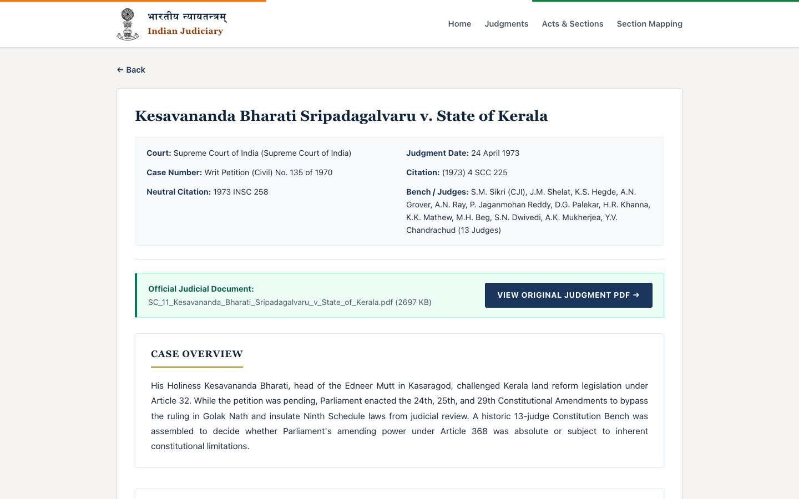
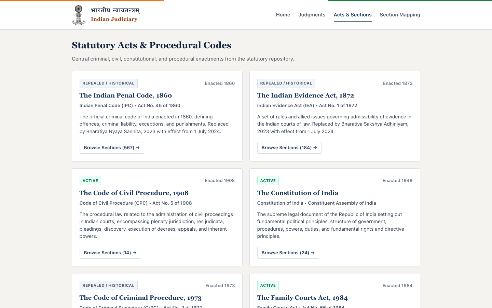
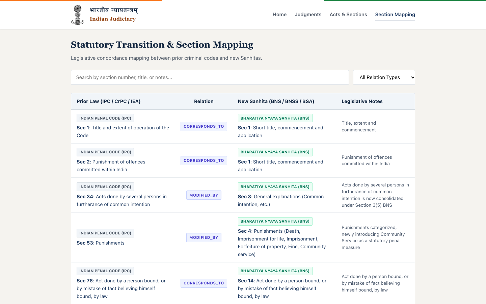
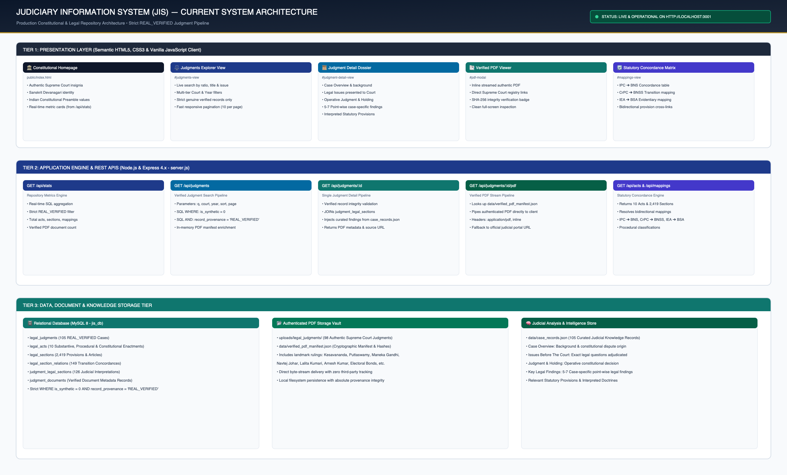
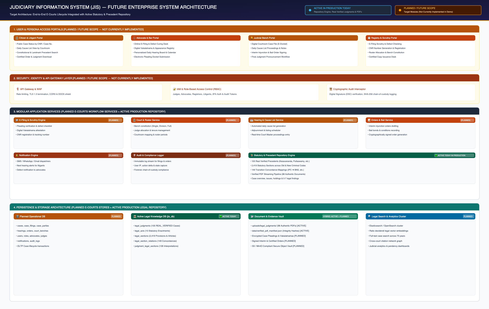
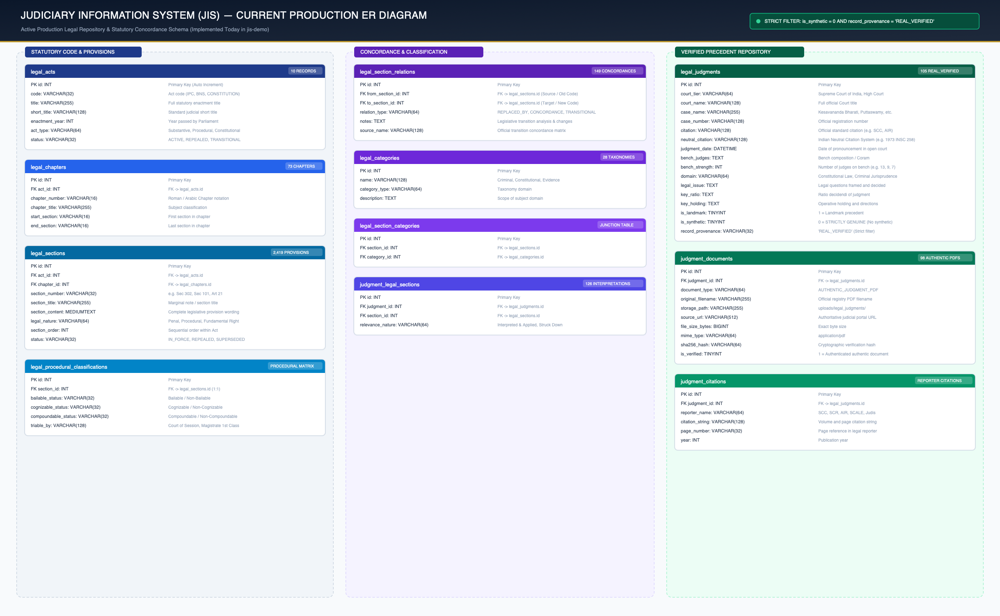
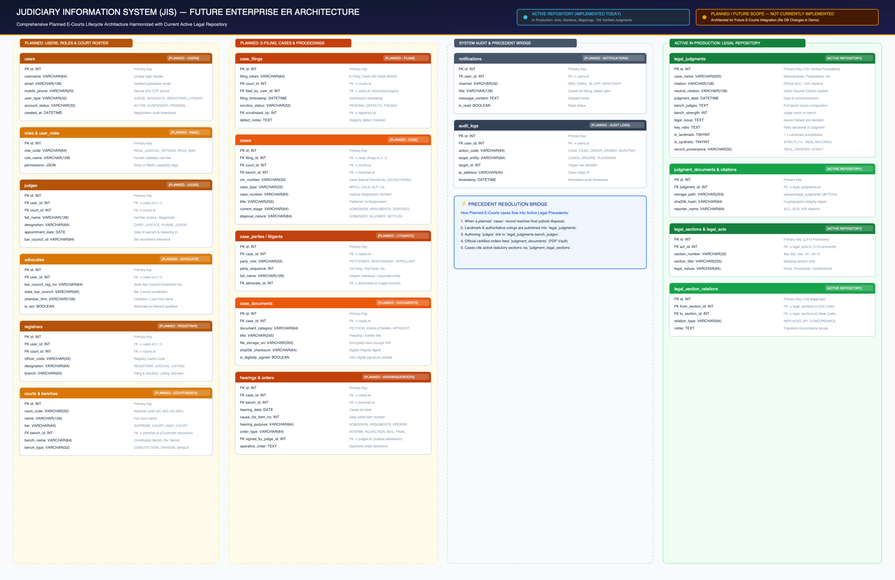

# भारतीय न्यायतन्त्रम् — Judiciary Information System (JIS)
### Constitutional & Statutory Legal Repository Platform

[](https://nodejs.org/)
[](https://expressjs.com/)
[](https://www.mysql.com/)
[](#-data-integrity--strict-provenance)
[](#-system-architecture)

> **यतो धर्मस्ततो जयः** — *Where there is Dharma (Righteousness / Law), there is Victory.*  
> **Judiciary Information System (JIS)** is a dedicated legal intelligence and constitutional repository platform modeling the judicial precedents, statutory provisions, and transition concordances of the Indian Legal System.

---

## 🏛️ Executive Overview

The **Judiciary Information System (JIS)** provides citizens, legal practitioners, and researchers with authoritative, tamper-free access to genuine Indian judicial precedents, statutory enactments across colonial and modernized criminal codes, and bidirectional legal concordances.

### Core Distinctions & Scope
- **Current Active System (Implemented in `jis-demo`)**: A high-performance, strictly verified legal intelligence repository containing **105 genuine landmark Supreme Court judgments**, **98 authenticated registry PDFs**, **10 statutory acts**, **2,419 legislative provisions**, and **149 statutory transition concordance mappings** (IPC ➔ BNS, CrPC ➔ BNSS, IEA ➔ BSA).
- **Future Enterprise Scope (Planned Architecture)**: An end-to-end judicial lifecycle platform encompassing E-Filing, case scrutiny, digital cause lists, courtroom proceedings, interim order signing, litigant notifications, and forensic audit logging.

> [!IMPORTANT]
> **Strict Implementation Boundary**: Planned future modules (such as Case Filing, Litigants, Hearings, Orders, Court Rosters, and RBAC) are documented and architected for future phases. **No database tables or schema alterations have been created in the running application for these future modules.** The running application operates exclusively on the verified legal repository tables.

---

## 💻 Tech Stack

| Layer | Technology | Specification / Implementation Details |
| :--- | :--- | :--- |
| **Runtime Environment** | Node.js | v18+ / v22+ Engine |
| **Backend Framework** | Express.js 5.x | Lightweight, high-throughput REST API server (`server.js`) |
| **Relational Database** | MySQL 8.0+ | Normalized relational engine (`jis_db`) with indexed query filters |
| **Database Driver** | `mysql2/promise` | Connection pooling, parameterized prepared statements, SQL injection immunity |
| **Frontend UI** | HTML5 / CSS3 / Vanilla JS | Semantic HTML5 (`index.html` <= 200 lines), zero external frontend dependencies |
| **Controller Architecture** | Vanilla JavaScript | Hash-based client router (`script.js` <= 180 lines) with asynchronous REST fetch |
| **Document Vault** | Local Filesystem & Static Stream | 98 authentic Supreme Court judgment PDFs served via direct byte streams |
| **Integrity Verification** | JSON Manifests & SHA-256 | Cryptographic document verification in `data/verified_pdf_manifest.json` |

---

## 📸 Application Showcase

The application features a clean, responsive, institutional visual identity designed specifically for Indian judicial records:

### 1. Constitutional Homepage & Identity
*Presents authentic Supreme Court insignia, Sanskrit Devanagari identity, preamble values, and real-time repository statistics.*


---

### 2. Verified Judgments Explorer
*Live search by ratio, case name, and legal issue with court-tier and year filtering for genuine verified decisions.*


---

### 3. Detailed Case Dossier & Verified PDF Viewer
*Individual case record featuring Case Overview, Issues Before The Court, Judgment & Holding, 5-7 Key Legal Findings, and direct PDF streaming.*


---

### 4. Statutory Acts & Provisions Directory
*Complete statutory repository covering 10 enactments, chapter groupings, and 2,419 provisions across old and new codes.*


---

### 5. Statutory Transition & Section Mapping
*Bidirectional concordance matrix translating sections of colonial criminal codes (IPC, CrPC, IEA) to the new Sanhitas (BNS, BNSS, BSA).*


---

## 🛡️ Data Integrity & Strict Provenance

This application strictly enforces data authenticity. All public judgment queries and APIs apply hard-coded SQL filters:

```sql
WHERE is_synthetic = 0 AND record_provenance = 'REAL_VERIFIED'
```

- **Zero Synthetic or Fabricated Records**: Absolutely no placeholder, mock, or synthetic records appear anywhere in search results, filters, pagination, or details.
- **Authoritative Precedents**: Covers landmark constitutional jurisprudence including *Kesavananda Bharati* (1973), *Maneka Gandhi* (1978), *Justice K.S. Puttaswamy (Privacy)* (2017), *Navtej Singh Johar* (2018), *Lalita Kumari* (2013), *Arnesh Kumar* (2014), *Joseph Shine* (2018), *ADR Electoral Bonds* (2024), and 97 additional verified authorities.
- **Cryptographic Document Vault**: 98 authentic judgments feature locally stored official PDFs with SHA-256 hashes indexed in `data/verified_pdf_manifest.json`.

---

## 🏗️ System Architecture

### 1. Current Production Architecture (Implemented Today)
Illustrates the running 3-tier architecture of the JIS Demo application:
- **Diagram Source**: [`docs/System-Architecture.mmd`](docs/System-Architecture.mmd)
- **High-Res Diagram**: [`docs/System-Architecture.png`](docs/System-Architecture.png)



- **Presentation Tier**: Semantic HTML5 (`public/index.html`), vanilla JS controller (`public/script.js`), responsive CSS design system (`public/styles.css`).
- **Application Tier**: Express REST API (`server.js`) providing `/api/stats`, `/api/judgments`, `/api/judgments/:id`, `/api/judgments/:id/pdf`, `/api/acts`, and `/api/mappings`.
- **Data & Knowledge Tier**: MySQL 8.0 (`jis_db`), verified PDF local cache (`uploads/legal_judgments/`), and curated judicial analysis (`data/case_records.json`).

---

### 2. Future Enterprise System Architecture (Planned Target)
Illustrates the comprehensive target architecture for the national-scale digital judiciary platform:
- **Diagram Source**: [`docs/Future-System-Architecture.mmd`](docs/Future-System-Architecture.mmd)
- **High-Res Diagram**: [`docs/Future-System-Architecture.png`](docs/Future-System-Architecture.png)



- **Layer 1: Multi-Channel Persona Portals**: Citizen Portal, Advocate Portal, Judicial Bench Portal, Registry Portal.
- **Layer 2: Security & API Gateway Layer**: WAF, Rate Limiting, IAM, RBAC, Cryptographic Audit Interceptor.
- **Layer 3: Modular Application Services**: E-Filing & Scrutiny Engine, Court & Roster Service, Hearing & Cause List Scheduler, Orders & Bail Service, Notification Dispatcher, Audit Logger, and the **Active Repository Engine** (in production today).
- **Layer 4: Multi-Tier Storage Infrastructure**: Operational Relational DB, Active Legal Knowledge DB, Encrypted Document Vault, and Legal Vector/Full-text Search Cluster (Elasticsearch/OpenSearch).

---

## 📐 Entity-Relationship (ER) Models

### 1. Current Production ER Diagram (Implemented in `jis_db`)
Accurately reflects the active schema, tables, and relationships currently running in `jis_db`:
- **Diagram Source**: [`docs/ER-Diagram-Current.mmd`](docs/ER-Diagram-Current.mmd)
- **High-Res Diagram**: [`docs/ER-Diagram-Current.png`](docs/ER-Diagram-Current.png)



#### Active Tables Implemented Today:
| Table Name | Records / Scope | Description |
| :--- | :--- | :--- |
| `legal_acts` | 10 Enactments | Statutory acts (Constitution, IPC, CrPC, IEA, BNS, BNSS, BSA, etc.) |
| `legal_chapters` | 73 Chapters | Legislative chapter groupings and subject classifications |
| `legal_sections` | 2,419 Provisions | Full text of statutory sections, articles, and schedules |
| `legal_section_relations` | 149 Mappings | Bidirectional concordance transition matrix (Old ➔ New Codes) |
| `legal_procedural_classifications` | Procedural Matrix | Bail status (Bailable/Non-Bailable), Cognizability, Trial Court |
| `legal_categories` | 28 Taxonomies | Subject classification domains (Constitutional, Criminal, Evidence) |
| `legal_section_categories` | Junction Table | Section-to-category associative mapping |
| `legal_judgments` | 105 Precedents | Strict `REAL_VERIFIED` judgments with bench, citation, ratio, and issues |
| `judgment_legal_sections` | 126 Interpretations| Provisions cited and interpreted in judgments |
| `judgment_documents` | 98 Local PDFs | Verified PDF files, storage paths, and cryptographic digests |
| `judgment_citations` | Official Citations | Reporter citations (SCC, SCR, AIR, SCALE, INSC) |

---

### 2. Future Enterprise ER Diagram (Planned Complete Architecture)
Presents the future-proof enterprise schema designed to incorporate full E-Courts lifecycle modules while harmonizing cleanly with the existing legal repository:
- **Diagram Source**: [`docs/ER-Diagram-Future.mmd`](docs/ER-Diagram-Future.mmd)
- **High-Res Diagram**: [`docs/ER-Diagram-Future.png`](docs/ER-Diagram-Future.png)



#### Planned Modules (Future Scope — Not Currently Implemented):
All future entities are architecturally decoupled and visually labeled as `[PLANNED / FUTURE SCOPE — NOT CURRENTLY IMPLEMENTED]`:
1. **User & Role Management**: `users`, `roles`, `user_roles`
2. **Judicial Roster & Officers**: `judges`, `advocates`, `registrars`, `courts`, `benches`, `bench_judges_roster`
3. **Case Docket & Litigants**: `case_filings`, `cases`, `case_parties_litigants`, `case_documents`
4. **Court Proceedings & Orders**: `hearings`, `orders`
5. **Cross-Cutting Modules**: `notifications`, `audit_logs`
6. **Integration Bridge to Active Repository**:
   - Disposed cases resolve into authoritative records in `legal_judgments`.
   - Authoring judges link to `legal_judgments.bench_judges`.
   - Filed pleadings cite `legal_sections` from the active repository.
   - Certified orders feed the authenticated document vault in `judgment_documents`.

---

## ⚖️ Current vs. Future Scope Breakdown

| Feature / Domain | Current Demo Implementation | Future Enterprise Roadmap |
| :--- | :--- | :--- |
| **Judgments Repository** | ✅ **105 Genuine Verified Precedents** | Automated registry ingestion & digest creation |
| **Judgment Full Text & PDFs** | ✅ **98 Verified Supreme Court PDFs** | Cloud S3 vault with distributed CDN replication |
| **Case Analysis** | ✅ **Overviews, Issues, Holdings, 5-7 Findings** | Natural language processing for auto-summaries |
| **Statutory Concordance** | ✅ **149 Colonial ➔ Sanhita Transitions** | Live legislative amendment concordance tracking |
| **Statutory Sections** | ✅ **2,419 Provisions across 10 Acts** | Pan-India Central & State statutory repository |
| **Authentication & RBAC** | ⏳ *Planned* (Public access only) | Role-based workflows (Judges, Bar, Registry) |
| **E-Filing & Scrutiny** | ⏳ *Planned* | Online defect notification and curing desk |
| **Case Dockets** | ⏳ *Planned* | CNR numbers, civil & criminal case stages |
| **Cause Lists & Hearings** | ⏳ *Planned* | Automated daily cause lists & courtroom notes |
| **Interim Orders & Bail** | ⏳ *Planned* | Digitally signed orders & bail verification |
| **Audit Trails** | ⏳ *Planned* | Immutable cryptographic action logging |

*Detailed architectural notes available in [`docs/ARCHITECTURE-AND-SCOPE.md`](docs/ARCHITECTURE-AND-SCOPE.md).*

---

## 🔌 API Endpoints Summary

All API endpoints are implemented in `server.js` and serve strictly verified data:

| Method | Endpoint | Query Parameters | Description |
| :--- | :--- | :--- | :--- |
| `GET` | `/api/stats` | — | Returns live counts for real judgments, acts, sections, mappings, and verified PDFs |
| `GET` | `/api/judgments/filters` | — | Returns court tiers and available judgment years for dropdown filters |
| `GET` | `/api/judgments` | `q`, `court`, `year`, `page`, `limit`, `sort` | Searches, filters, and paginates verified landmark judgments |
| `GET` | `/api/judgments/:id` | — | Full case dossier: metadata, cited provisions, PDF link, and curated findings |
| `GET` | `/api/judgments/:id/pdf` | — | Streams authentic verified judgment PDF directly to the client browser |
| `GET` | `/api/acts` | — | Lists all 10 statutory acts with total section counts |
| `GET` | `/api/acts/:id` | — | Act detail with complete ordered section listing |
| `GET` | `/api/sections/:id` | — | Section text, incoming/outgoing concordance transitions, and citing judgments |
| `GET` | `/api/mappings` | — | Full statutory transition matrix (Old Codes ➔ New Sanhitas) |

*Detailed request and response schemas available in [`docs/API-DOCUMENTATION.md`](docs/API-DOCUMENTATION.md).*

---

## 🚀 Setup & Local Installation

### Prerequisites
- **Node.js** v18.0.0 or higher
- **MySQL** 8.0+ running on port `3307` (or configured via `.env`)
- **npm** v9+

### Installation Steps
1. **Clone the Repository**:
   ```bash
   git clone https://github.com/abhis1905/jis-demo.git
   cd jis-demo
   ```

2. **Install Dependencies**:
   ```bash
   npm install
   ```

3. **Configure Environment Variables**:
   Copy `.env.example` to `.env` and configure your local MySQL credentials:
   ```bash
   cp .env.example .env
   ```
   ```ini
   PORT=3001
   DB_HOST=127.0.0.1
   DB_PORT=3307
   DB_USER=root
   DB_PASSWORD=your_mysql_password
   DB_NAME=jis_db
   NODE_ENV=development
   ```

4. **Start the Application Server**:
   ```bash
   npm start
   # or
   node server.js
   ```

5. **Open in Browser**:
   Visit `http://localhost:3001` in your browser.

---

## 📁 Project Directory Structure

```
jis-demo/
├── .env.example                     # Environment template (NO secrets)
├── .gitignore                       # Airtight git rules (excludes .env, credentials, logs)
├── package.json                     # Node.js dependencies and run scripts
├── server.js                        # Express REST engine & verified data pipeline
├── db.js                            # MySQL 8 connection pool
├── README.md                        # Master project documentation
├── data/
│   ├── case_records.json            # Curated case overviews, issues, holdings, and findings
│   └── verified_pdf_manifest.json   # 98 authentic judgment PDF verification hashes
├── docs/
│   ├── API-DOCUMENTATION.md         # Exhaustive REST API specification
│   ├── ARCHITECTURE-AND-SCOPE.md    # Detailed Current vs Future scope breakdown
│   ├── ER-Diagram-Current.mmd       # Mermaid source: Current production ER diagram
│   ├── ER-Diagram-Current.png       # High-res image: Current production ER diagram
│   ├── ER-Diagram-Future.mmd        # Mermaid source: Future enterprise ER diagram
│   ├── ER-Diagram-Future.png        # High-res image: Future enterprise ER diagram
│   ├── System-Architecture.mmd      # Mermaid source: Current system architecture
│   ├── System-Architecture.png      # High-res image: Current system architecture
│   ├── Future-System-Architecture.mmd # Mermaid source: Future system architecture
│   ├── Future-System-Architecture.png # High-res image: Future system architecture
│   └── screenshots/                 # Application visual walkthrough
│       ├── 01-homepage.png
│       ├── 02-judgments-repository.png
│       ├── 03-judgment-detail.png
│       ├── 04-acts-and-sections.png
│       └── 05-section-mappings.png
├── public/
│   ├── index.html                   # Semantic HTML5 UI (< 200 lines)
│   ├── script.js                    # Vanilla JS client logic (< 180 lines)
│   ├── styles.css                   # Custom responsive design system & judicial theme
│   └── assets/                      # Authentic Supreme Court emblem & insignia
├── scripts/
│   ├── generate_diagram_pngs.py     # High-resolution diagram generator
│   ├── download_all_verified_pdfs.js# Verified PDF synchronization utility
│   └── combine_cases.py             # Validation and compilation pipeline for case records
└── uploads/
    └── legal_judgments/             # 98 authentic Supreme Court judgment PDF documents
```

---

## 🔒 Security & Secrets Exclusion

- All secrets, passwords, and `.env` files are strictly excluded via `.gitignore`.
- Only `.env.example` is committed, providing safe template placeholders.
- The application implements parameterized SQL queries throughout, completely mitigating SQL injection vulnerabilities.
- Document delivery strictly uses sanitized filesystem paths and verified SHA-256 hashes.

---

## 📜 License & Acknowledgments

This project is developed as an independent judicial research demonstration. All judicial records, statutory texts, and constitutional materials cited are in the public domain under Indian law.
